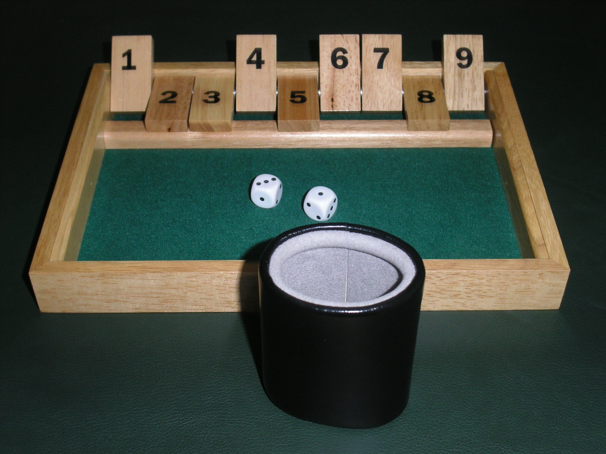

# Shut the Box Solver

A [Shut the Box](https://en.wikipedia.org/wiki/Shut_the_box) game [solver](https://en.wikipedia.org/wiki/Solved_game), written in Rust.

- [Shut the Box Solver](#shut-the-box-solver)
  - [Usage](#usage)
  - [What is Shut the Box?](#what-is-shut-the-box)
  - [What is This Program For?](#what-is-this-program-for)
  - [How Does this Work?](#how-does-this-work)
    - [Naive Solution](#naive-solution)

## Usage

TODO

## What is Shut the Box?

Shut the Box is a game usually played with (2) 6-sided dice and tiles labeled 1-9.

The typical rules are as follows:

- Each turn starts by rolling the dice
- You must flip tiles summing to your roll
  - Ex: Rolling 5+1=6, you can remove one of the following tile combinations, if they're not flipped already: (6), (4,2), (1,2,3), etc.
- You win if you flip all tiles and therefore "shut the box"
- You lose if you cannot flip tiles summing exactly to your roll
- You may roll (1) die if each remaining tile can be removed with a single die roll
  - i.e. for a 6 sided die, all remaining tiles are 6 or less

Some optional rules include:

- Limit the number of tiles you can flip (typically 2)
- Change the number of tiles (1 - 12 is also common)
- You score based on the number of tiles rather than win/lose

## What is This Program For?

This program will "solve" the perfect strategy for any given roll with any arrangement of tiles and die-faces.
<!-- TODO update when n-num dice works :) -->

Given any initial state, this solver can give you the chance of winning the game with perfect play.

## How Does this Work?

Let's define a data structure that contains remaining tiles. I'll refer to this as as a `GameState`.

Because each tile is either up or down, we can represent each tile in a `GameState` with one of 2 possible states.

For a game with $n$ tiles, there logically must be a maximum $2^n$ game states.

For the typical game with $9$ tiles, that means there are only $2^9=512$ possible game states! This sounds incredibly solvable.

### Naive Solution

To organize these `GameStates`, we can create a tree such that the parent game is at the top, and all possible next `GameStates` are direct descendents.
